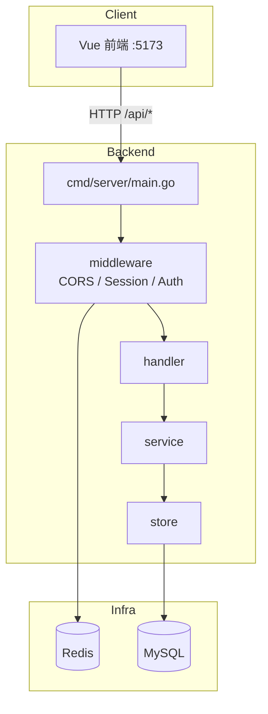

# AI Content Creator — 后端服务文档

本文档描述 `backend/` 目录下的 Go 后端服务架构、技术栈与核心代码设计。

---

## 1. 项目概述

后端为 **AI Content Creator** 项目提供 REST API，当前已实现用户模块（注册、登录、Session 鉴权、管理员用户 CRUD）。采用经典分层架构，基于 Gin 框架，数据持久化使用 MySQL + GORM，登录态通过 Redis Session 管理。

- **模块名**：`github.com/ai-content-creator/backend`
- **Go 版本**：1.25.0
- **默认端口**：8123
- **API 前缀**：`/api`（可在 `config.yaml` 中配置 `context_path`）

---

## 2. 技术栈

| 类别 | 技术 | 用途 |
|------|------|------|
| 语言 | Go 1.25 | 后端开发 |
| Web 框架 | [Gin](https://github.com/gin-gonic/gin) v1.12 | HTTP 路由、中间件 |
| ORM | [GORM](https://gorm.io/) v1.31 + MySQL Driver | 数据库访问 |
| 数据库 | MySQL 8.x | 业务数据存储 |
| 缓存 / Session | Redis + gin-contrib/sessions | Session 持久化 |
| 配置 | [Viper](https://github.com/spf13/viper) | 读取 `config.yaml` |
| API 文档 | [Swaggo](https://github.com/swaggo/swag) | Swagger 注解与 UI |

### 主要依赖（go.mod）

```
github.com/gin-gonic/gin
github.com/gin-contrib/sessions
gorm.io/gorm
gorm.io/driver/mysql
github.com/spf13/viper
github.com/swaggo/gin-swagger
github.com/swaggo/files
github.com/swaggo/swag
```

---

## 3. 目录结构

```
backend/
├── cmd/server/main.go          # 程序入口：加载配置、初始化 App、注册路由
├── internal/
│   ├── app/app.go              # 应用组装：依赖注入（Store → Service → Handler）
│   ├── config/config.go        # 配置结构体与 Viper 加载
│   ├── common/                 # 公共模块
│   │   ├── constants.go        # 常量（Session 键、角色、分页默认值等）
│   │   ├── error.go            # 统一业务错误 AppError
│   │   └── response.go         # 统一 JSON 响应 BaseResponse
│   ├── model/                  # 数据模型
│   │   ├── user.go             # User 实体、LoginUser/UserInfo 响应、角色枚举
│   │   └── request.go          # 请求 DTO、分页结果 PageResult
│   ├── store/user.go           # 数据访问层（GORM CRUD）
│   ├── service/user.go         # 业务逻辑层
│   ├── handler/                # HTTP 接口层
│   │   ├── user.go
│   │   └── health.go
│   └── middleware/             # 中间件
│       ├── cors.go             # 跨域
│       ├── session.go          # Redis Session
│       └── auth.go             # 登录与角色鉴权
├── docs/                       # Swag 自动生成的 Swagger 文档
├── sql/create_table.sql        # 建表与测试数据
├── config.yaml.example         # 配置模板（实际 config.yaml 在 .gitignore）
├── go.mod / go.sum
└── backend.md                  # 本文档
```

---

## 4. 分层架构

```
HTTP 请求
    │
    ▼
┌─────────────────────────────────────┐
│  Middleware（中间件）                  │
│  CORS → Session → AuthCheck（可选）    │
└─────────────────────────────────────┘
    │
    ▼
┌─────────────────────────────────────┐
│  Handler（接口层 / Controller）       │
│  解析请求、调用 Service、返回 JSON     │
└─────────────────────────────────────┘
    │
    ▼
┌─────────────────────────────────────┐
│  Service（业务层）                    │
│  校验、加密、Session、错误转换          │
└─────────────────────────────────────┘
    │
    ▼
┌─────────────────────────────────────┐
│  Store（数据访问层 / DAO）             │
│  GORM 查询、软删除、分页                │
└─────────────────────────────────────┘
    │
    ▼
  MySQL
```

### 各层职责

| 层 | 包路径 | 职责 | 是否感知 HTTP |
|----|--------|------|---------------|
| Middleware | `internal/middleware` | 横切逻辑：跨域、Session、鉴权 | 是 |
| Handler | `internal/handler` | 绑定参数、调 Service、写 JSON | 是 |
| Service | `internal/service` | 业务规则、密码加密、登录态 | 否 |
| Store | `internal/store` | 数据库 CRUD、查询构建 | 否 |

依赖注入在 `app.New()` 中完成：

```go
userStore   := store.NewUserStore(db)
userService := service.NewUserService(userStore)
userHandler := handler.NewUserHandler(userService)
```

**原则**：Handler 只调 Service，Service 只调 Store，不跨层、不反向依赖。

---

## 5. 请求处理流程

以 **用户登录** `POST /api/user/login` 为例：

1. **CORS 中间件**：设置跨域响应头，放行 OPTIONS
2. **Session 中间件**：读取/创建 Session Cookie
3. **Handler.Login**：`ShouldBindJSON` 解析请求体
4. **Service.Login**：校验参数 → MD5 加密密码 → Store 查用户
5. **Store**：`GetByAccountAndPassword` 执行 SQL
6. **Service**：`session.Set("userLoginState", userID)` 写入登录态
7. **Handler**：`c.JSON(Success(loginUser))` 返回 JSON

管理员接口（如 `POST /api/user/add`）额外经过 **AuthCheck** 中间件，校验登录 + admin 角色。

---

## 6. API 接口

Base Path：`/api`

### 6.1 系统

| 方法 | 路径 | 说明 | 鉴权 |
|------|------|------|------|
| GET | `/health` | 健康检查，返回 `ok` | 无 |
| GET | `/swagger/*any` | Swagger UI | 无 |
| GET | `/v3/api-docs` | OpenAPI JSON | 无 |

### 6.2 用户

| 方法 | 路径 | 说明 | 鉴权 |
|------|------|------|------|
| POST | `/user/register` | 用户注册 | 无 |
| POST | `/user/login` | 用户登录 | 无 |
| GET | `/user/get/login` | 获取当前登录用户 | 需登录（Handler 内查 Session） |
| POST | `/user/logout` | 注销 | 需登录 |
| GET | `/user/get/vo` | 按 ID 获取用户信息（脱敏） | 需登录 |
| POST | `/user/add` | 创建用户 | 管理员 |
| GET | `/user/get` | 按 ID 获取用户 | 管理员 |
| POST | `/user/update` | 更新用户 | 管理员 |
| POST | `/user/delete` | 删除用户（软删） | 管理员 |
| POST | `/user/list/page/vo` | 分页查询用户列表 | 管理员 |

Swagger 在线文档：`http://localhost:8123/api/swagger/index.html`

---

## 7. 统一响应格式

所有接口（含错误）多数返回 HTTP 200，通过 JSON `code` 区分成败：

```json
{
  "code": 0,
  "data": { ... },
  "message": "ok"
}
```

| code | 含义 |
|------|------|
| 0 | 成功 |
| 40000 | 请求参数错误 |
| 40100 | 未登录 |
| 40101 | 无权限 |
| 40400 | 数据不存在 |
| 50000 | 系统内部异常 |
| 50001 | 操作失败 |

鉴权失败时 Middleware 返回 HTTP 401/403，body 仍为上述 JSON 结构。

---

## 8. 认证与 Session

### 8.1 Session 存储

- 使用 **Redis** 作为 Session 后端（`middleware/session.go`）
- Cookie 名：`session`
- Session 中只存用户 ID，键名：`userLoginState`（`common.UserLoginState`）
- 配置项：`session.secret`（加密密钥）、`session.max_age`（默认 30 天）

### 8.2 登录流程

```
Login → 校验账号密码 → session.Set(userID) → session.Save()
```

### 8.3 鉴权中间件 AuthCheck

```go
adminAuth := middleware.AuthCheck(application.UserService, common.AdminRole)
user.POST("/add", adminAuth, application.UserHandler.Add)
```

逻辑概要：

1. 从 Session 取用户 ID，查库得完整用户 → 未登录返回 401
2. `mustRole == ""` → 只验登录，放行
3. `mustRole == "admin"` → 要求用户角色为 admin，否则 403
4. 通过后 `c.Set("loginUser", loginUser)` 供后续 handler 使用

### 8.4 密码加密

- 算法：`MD5(password + salt)`，盐值 `"yupi"`（`common.PasswordSalt`）
- 默认密码（管理员创建用户）：`12345678`

> 生产环境建议升级为 bcrypt / argon2。

---

## 9. 数据库设计

### 9.1 用户表 `user`

| 字段 | 类型 | 说明 |
|------|------|------|
| id | bigint | 主键 |
| userAccount | varchar(256) | 账号，唯一索引 |
| userPassword | varchar(512) | 加密密码 |
| userName | varchar(256) | 昵称 |
| userAvatar | varchar(1024) | 头像 URL |
| userProfile | varchar(512) | 简介 |
| userRole | varchar(256) | 角色：user / admin / vip |
| editTime | datetime | 编辑时间 |
| createTime / updateTime | datetime | 创建/更新时间 |
| isDelete | tinyint | 软删除标记（0 正常，1 已删） |

建表脚本：`sql/create_table.sql`

### 9.2 测试账号

| 账号 | 密码 | 角色 |
|------|------|------|
| admin | 12345678 | admin |
| user | 12345678 | user |
| test | 12345678 | user |

### 9.3 软删除

Store 层通过 GORM Scope `NotDeleted` 过滤 `isDelete = 0`；删除操作为 `UPDATE isDelete = 1`。

---

## 10. 核心模块说明

### 10.1 Handler（`internal/handler/user.go`）

- 解析 JSON / Query 参数（Gin `ShouldBindJSON` / `ShouldBindQuery`）
- 调用 Service，通过 `handleError` 统一错误转 JSON
- 含 Swagger 注解（`@Summary`、`@Router` 等）

### 10.2 Service（`internal/service/user.go`）

| 方法 | 功能 |
|------|------|
| Register | 注册：校验、查重、加密、默认角色 user |
| Login | 登录：校验、查库、写 Session |
| GetLoginUser | 从 Session 取 ID 再查库 |
| Logout | 清除 Session |
| Create | 管理员创建用户（默认密码） |
| GetByID / Update / Delete | 用户 CRUD |
| ListByPage | 条件分页，返回 UserInfo 列表 |

### 10.3 Store（`internal/store/user.go`）

- 基础 CRUD + 按账号查重、按账号密码登录
- `BuildQuery`：动态条件（ID、账号/昵称/简介模糊、角色、排序）
- `List`：分页查询
- 预留方法（尚未在 Service/Handler 暴露）：`DecrementQuota`、`UpgradeToVIP`、`RevokeVIP`

### 10.4 Model（`internal/model`）

- **User**：数据库实体，含 GORM / JSON 标签
- **LoginUser / UserInfo**：面向前端的响应结构（不含密码）
- **RegisterRequest / LoginRequest 等**：请求 DTO
- **UserRole**：角色枚举 `user` | `admin` | `vip`

---

## 11. 中间件

| 文件 | 功能 |
|------|------|
| `cors.go` | 允许 `http://localhost:5173` 跨域，支持 Credentials |
| `session.go` | Redis Session 初始化，HttpOnly Cookie |
| `auth.go` | 登录态 + 管理员角色校验 |

全局中间件在 `main.go` 中注册：

```go
r.Use(middleware.CORS())
middleware.SetupSession(r, cfg)
```

---

## 12. 配置说明

复制 `config.yaml.example` 为 `config.yaml`（已在 `.gitignore` 中忽略）：

```yaml
server:
  port: 8123
  context_path: /api

database:
  host: localhost
  port: 3306
  name: ai_passage_creator
  user: root
  password: "..."
  max_idle_conns: 10
  max_open_conns: 100

redis:
  host: localhost
  port: 6379
  db: 0
  password: ""

session:
  secret: "your-session-secret-change-this"
  max_age: 2592000  # 30 天

log:
  level: info
  file_path: logs/app.log
```

---

## 13. 开发与运行

### 13.1 环境准备

1. 安装 Go 1.25+
2. 启动 MySQL，执行 `sql/create_table.sql`
3. 启动 Redis
4. 复制并填写 `config.yaml`

### 13.2 常用命令

在项目根目录（含 `package.json`）：

```bash
# 启动后端
pnpm backend
# 等价于：go run -C backend ./cmd/server/main.go

# 重新生成 Swagger 文档
pnpm swagger
# 等价于：cd backend && swag init -g cmd/server/main.go -o docs
```

在 `backend/` 目录下也可直接：

```bash
go run ./cmd/server/main.go
swag init -g cmd/server/main.go -o docs
```

### 13.3 Swagger

- UI：`http://localhost:8123/api/swagger/index.html`
- JSON：`http://localhost:8123/api/v3/api-docs`

修改 handler 注解后需重新执行 `pnpm swagger` 并重启服务。

---

## 14. 架构图（Mermaid）



---

## 15. 待扩展 / 已知事项

- Store 中已有 VIP 配额相关方法（`DecrementQuota`、`UpgradeToVIP`、`RevokeVIP`），Service/Handler 尚未对接，预留给 AI 内容生成与 VIP 功能
- 密码使用 MD5+盐，生产环境建议升级
- `AuthCheck` 中 `c.Set("loginUser", ...)` 已写入 Context，但 Handler 目前仍自行查 Session，可后续统一改为从 Context 读取
- `log` 配置项已定义，尚未接入文件日志库

---

## 16. 相关文件索引

| 文件 | 说明 |
|------|------|
| `cmd/server/main.go` | 入口与路由注册 |
| `internal/app/app.go` | 依赖组装与 DB 初始化 |
| `internal/handler/user.go` | 用户 HTTP 接口 |
| `internal/service/user.go` | 用户业务逻辑 |
| `internal/store/user.go` | 用户数据访问 |
| `internal/middleware/auth.go` | 鉴权中间件 |
| `internal/common/error.go` | 错误码定义 |
| `sql/create_table.sql` | 数据库初始化 |
